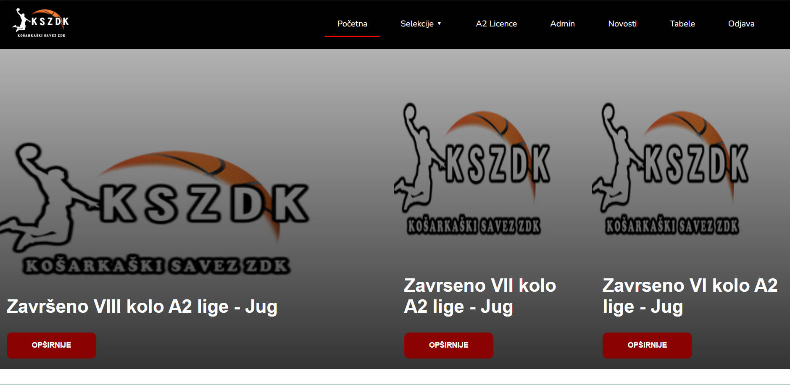
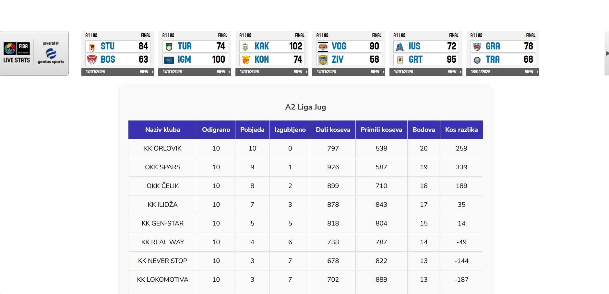
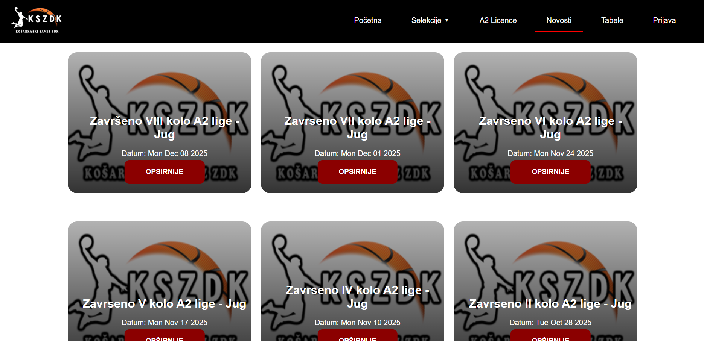
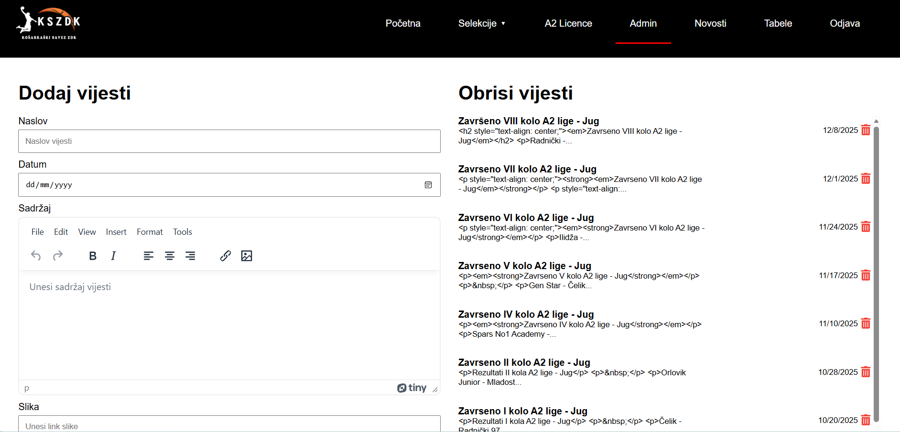
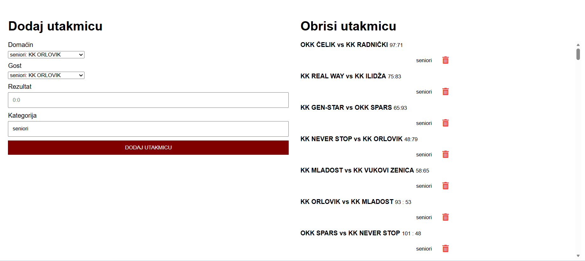

# 🏀 KSZDK – Basketball Federation of Zenica-Doboj Canton | Web Application

A full-stack web application for managing and monitoring the **KSZDK basketball league**.  
The application provides real-time access to all relevant league information, along with a dedicated **admin panel** for content and match management.

The project is developed using **HTML, CSS, and JavaScript** on the frontend, and **Node.js, Express, and MongoDB** on the backend.

---

## 🌐 Public Features

- Homepage with general league information
- News and announcements
- Player licenses:
  - Youth league
  - Senior league
- Teams and players overview
- Live match statistics
- Match results
- League tables (standings)

---

## 🔐 Administrator Features

- Secure admin authentication
- Create, edit, and delete:
  - News
  - Matches
  - Results
- Automatic league table updates
- Content management without direct database access

---

## 🛠️ Technologies

### Frontend
- HTML  
- CSS  
- JavaScript (Vanilla)

### Backend
- Node.js  
- Express.js  

### Database
- MongoDB  
- Mongoose  

---

## 📸 Screenshots


### Homepage



### Player Licenses


### News


### League Table & Results


### Admin Panel



---

## ⚙️ Installation and Setup

### 1️⃣ Clone the repository
```bash
git clone https://github.com/EnisHalac/KSZDKLICENCE.git
cd KSZDKLICENCE
